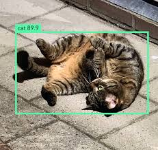

# Real-Time Feral Cat Detection and Audio Alert System  
---

This project is a real-time object detection system designed to identify feral cats near your door using a webcam. The system generates an audio alert in Bengali to notify you when a cat is detected.




## Features
--- 

- **Real-Time Detection**: Utilizes YOLOv5 for efficient and accurate cat detection.  
- **Custom Audio Alert**: Plays a audio(in Bengali) alert ("A cat is here!") whenever a cat is detected.  
- **Simple Setup**: Requires only a webcam and minimal setup.  

## Usage
---

1. Clone the yolov5 repository:  
   ```bash
   git clone https://github.com/ultralytics/yolov5.git
   cd yolov5

2. install requirements for both yolo and modified code:
   ```bash
   pip install -r requirements.txt
   pip install playsound

3. install **torch** based on your device compatibility

4. delete the detect.py file from yolo folder

5. download **cat_alert.mp3**, **detect.py**, **best_fixed.pt**(weights) from this repo and move to yolov5 folder

6. run it:
   ```bash
   python detect.py --weights best_fixed.pt --source 0

***P.S.*** if you are not using your webcam, change the source with the link of your camera(e.g. "http://192.164.1.193:4259/" for your phone's ipwebcam)


### Known Issues
---

- **PosixPath Issue with Saved Weights on Windows**: 
  When running the model with saved weights (best.pt) on a Windows machine, you might encounter a "NotImplementedError" due to a `PosixPath` object in the model checkpoint. This is caused by the "opt" dictionary in the checkpoint containing a key "evolve_population" with a value specific to Unix-based systems. The issue does not occur when using pretrained weights provided by the yolov5(e.g. yolov5s.pt). 
  
  **Solution:** it is already fixed for weights provided here but if you want to train your own model then modify the checkpoint file to replace `PosixPath` with a string representation of the path, or run the notebook in a Unix-based environment.(or just use the code from this notebook)

***Note:*** training data is not provided due to size and privacy reasons, if you want to train the model use your own data(that will perform better too in your environment)
